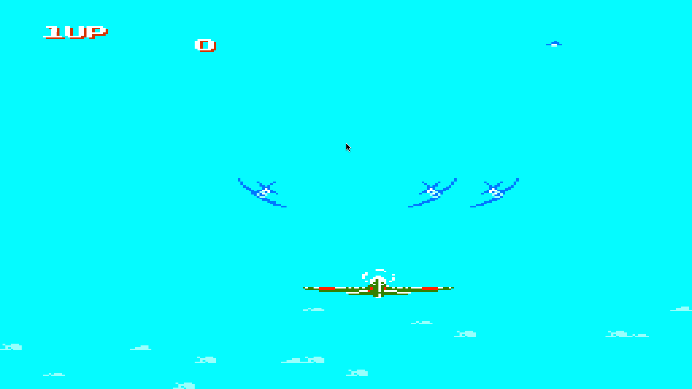
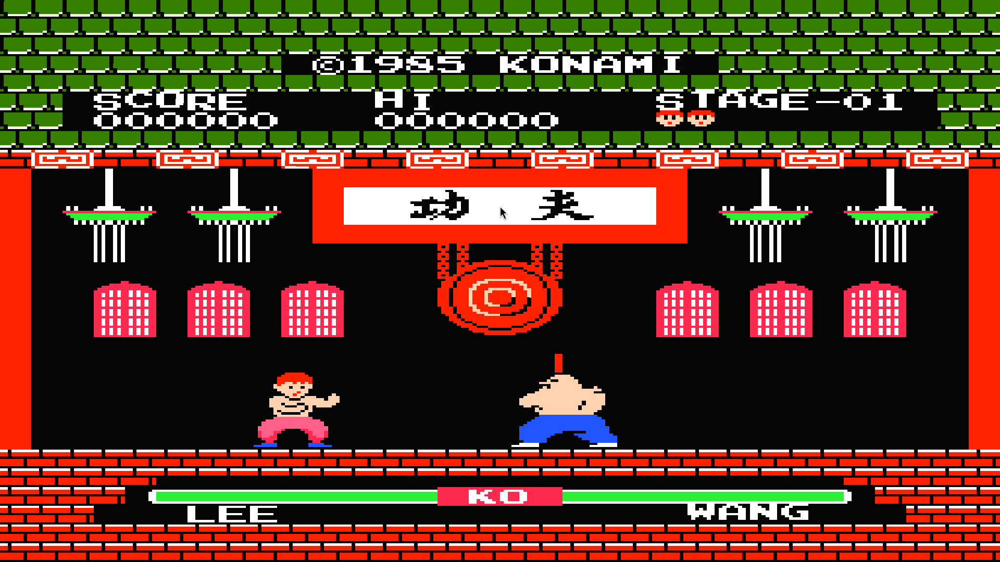
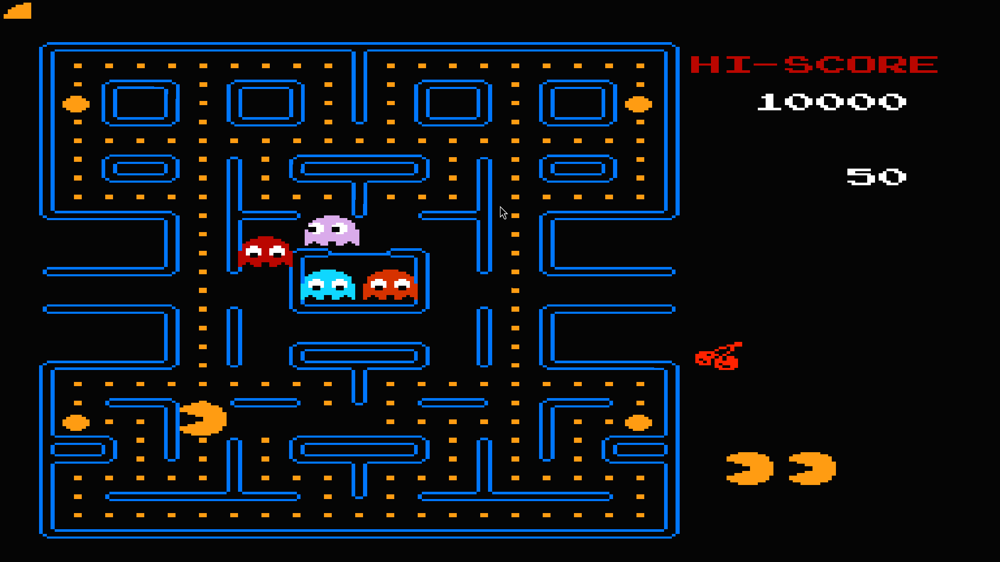
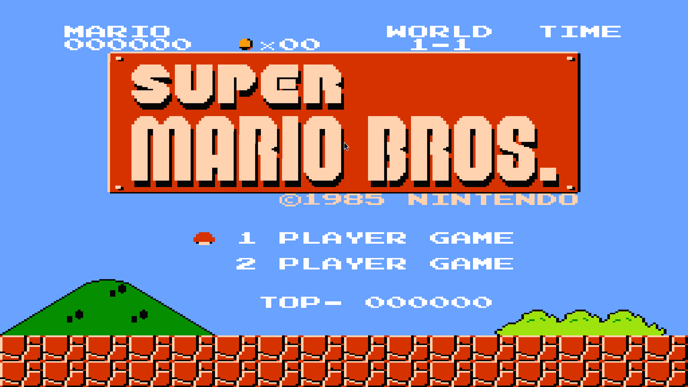

# rnes

**rnes** is a Rust-based NES (Nintendo Entertainment System) emulator.  
This project is my personal exploration into the world of emulator development, focused on understanding the 6502 CPU architecture, NES graphics, and modern Rust programming.







## Features

- **CPU:** Partial 6502 emulation, with ongoing improvements
- **Graphics:** Simple 32x32 framebuffer rendering using SDL2
- **Input:** Keyboard controls (WASD for movement, Escape to quit)
- **Game Example:** Includes a basic "snake" game ROM for demonstration
- **Random Number Generation:** Used for in-game events
- **Modular Design:** Codebase structured for extensibility and future features

## Getting Started

### Prerequisites

- Rust (latest stable version recommended)
- [SDL2](https://github.com/libsdl-org/SDL) development libraries (must be installed on your system)

### Building

Clone this repository and build:

```bash
git clone https://github.com/SyedAsadK/rnes.git
cd rnes
cargo run --release
```

```

> **Note:** If you encounter build errors related to SDL2, ensure the SDL2 development libraries are correctly installed for your operating system.

> **Note:** You need to input the rom name as argument, also supports --tiles arguement for sprites

### Controls

- **W**: Up
- **A**: Left
- **S**: Down
- **D**: Right
- **Escape**: Quit

## Project Structure

- `src/comp/cpu.rs` — 6502 CPU emulation core
- `src/main.rs` — SDL2 setup, emulation loop, game integration
- `src/comp/` — Emulator components (graphics, input, etc.)

## Known Issues & Limitations

- Not a full-featured NES emulator; work in progress
- Basic framebuffer output (32x32 grid only)
- Only runs bundled simple games (no support for commercial NES ROMs yet)
- Sound and advanced graphics features are not implemented

---

```
